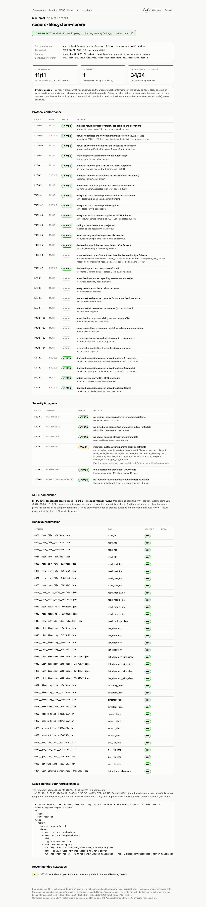

<div align="center">

# 🧾 mcp-proof

### 交付 MCP 服务器，附带一张「收据」。

**从线级审计任意 MCP 服务器——一致性、安全、回归三类证据，汇成一份可复现、可离线校验的交付报告。**

`stdio + Streamable HTTP · 2026-07-28 + legacy 双时代 · HTML / JSON / JUnit / SARIF`

[](https://github.com/YuCPbit/mcp-proof/actions/workflows/ci.yml)
[](pyproject.toml)
[](src/mcpproof/checks/)
[](src/mcpproof/client_http.py)
[](LICENSE)

[English](README.md) · [简体中文](README.zh-CN.md)

<a href="https://yucpbit.github.io/mcp-proof/report-filesystem.html"></a>

**[在线浏览全部审计报告 →](https://yucpbit.github.io/mcp-proof/)**

*对官方 MCP filesystem 服务器的真实审计：27 项协议检查、MSSS 合规表、34 个回归重放——SHIP-READY，附 1 条建议级发现。*

</div>

---

## 🚀 快速开始

```bash
pip install git+https://github.com/YuCPbit/mcp-proof
mcp-proof run python my_server.py --fixtures fixtures/ --record-if-missing --out report.html
```

审计一个运行中的 HTTP 服务器？`mcp-proof run --url http://localhost:8000/mcp --out report.html`

退出码就是门禁：**`0`**——所有 MUST 检查通过、无阻断级安全发现（建议级可存在）、零行为漂移；**`1`**——审计完成且服务器未通过；**`2`**——审计未完成（缺基线、审计器内部错误），对服务器的好坏**均不构成任何证明**。

```bash
mcp-proof plan python my_server.py                             # 自动基线会调用什么、依据是什么
mcp-proof record python my_server.py --fixtures fixtures/      # 冻结行为契约
mcp-proof replay --fixtures fixtures/ -- python my_server.py   # 任何漂移即失败
mcp-proof inspect python my_server.py --out baseline.json      # 冻结契约面
mcp-proof diff baseline.json current.json                      # BREAKING / ADDITIVE / METADATA，破坏性变化 exit 1
mcp-proof verify report.json                                   # 离线复核报告的内部指纹
```

用内置的对照演示 60 秒看懂差别——一个干净的服务器 vs 一个埋了九处违规的服务器：

```bash
mcp-proof run python demo/good_server.py --fixtures demo/fixtures-good --out report-good.html   # → SHIP-READY
mcp-proof run python demo/bad_server.py --out report-bad.html                                    # → 5 项 MUST 失败，3 项安全发现
```

## 🔬 三条审计车道

| 车道 | 证明什么 | 怎么做 |
|---|---|---|
| **协议一致性** | 服务器在线级正确实现了 MCP——时代协商、JSON-RPC 错误语义、工具与输出 schema、能力一致性、分页、stdout 卫生 | 手写 JSON-RPC 探针直接观测原始字节流，任何瑕疵无处藏身 |
| **安全与卫生** | 工具元数据干净：没有注入指令、隐藏 Unicode、泄漏的密钥或无约束的执行面 | 确定性静态分析，每项发现携带 MSSS 控制 ID |
| **行为回归** | 服务器的行为和交付那天一模一样 | 溯源指纹化黄金 fixtures 的录制/重放，漂移按严重度分级 |

三条车道汇入一份报告——报告以按优先级排序的修复清单收尾，天然兼任整改方案。

## ✅ 验证凭据

审计工具必须比它审计的东西更值得信任。每个版本背后站着：

- **140 个测试**，其中一整套对抗性测试打的就是审计器自己：藏在列表第二页的违规、被篡改的 fixtures 与 manifest、删哈希降级攻击、改过结论横幅的报告、曾经漏网的漂移类别、不合法的合成基线。
- **Linux / macOS / Windows × Python 3.11 / 3.12 / 3.13 全矩阵 CI**，外加打包岗位：构建 wheel、全新安装、对真实服务器跑一次真实审计，然后才允许发布。
- **与官方 v2 SDK 双向互验**：官方客户端通过 `server/discover` 接纳 mcp-proof 手写的现代测试服务器；mcp-proof 对官方 v2 SDK 服务器在两种传输上全绿（`scripts/crosscheck_modern_server.py`）。
- **Fail-closed 是设计原则**：分页走不完、fixture 被篡改或无法验证、基线缺失、审计器内部出错——每一种都大声停下，而且每条命令用同一套分类学作答：exit `2` 加一行稳定输出，绝不冒 traceback，绝不缩小审计范围继续跑，也绝不把自己的错算成服务器的错。
- **报告可离线校验**：`mcp-proof verify report.json` 用报告自身字段重算两枚指纹；文档指纹覆盖读者看到的一切——结论横幅、审计状态、汇总计数、MSSS 表、后续步骤——审计之后的任何改动都会破坏它。这是内部一致性证明，不是签名（签名 attestation 在路线图上）。

## ✨ 引擎盖下

- 🔍 **覆盖全部面、全部分页、两个时代的线级检查** —— mcp-proof 直接对服务器说原始 JSON-RPC 并自动识别其时代：2026-07-28 现代时代 32 项（`server/discover`、`_meta` envelope 强制、`resultType`、所有可缓存结果的 `ttlMs`/`cacheScope`、-32022 版本拒绝、HTTP 路由 header 强制），initialize 握手时代 27 项——精确错误码、schema 合法性、结构化输出、stdout 卫生、三个列表面各自的分页安全、专门的 resources 与 prompts 车道，以及**验证过的负向探测**：TOOL-07 发送可证明违反 inputSchema 的输入（先证明基线合法、再只改动一个字段的最小复现），服务器若正常应答即告警——挂死不算拒绝，它是另一个发现。所有车道共用同一个分页采集器，藏在第二页的工具和第一页受到完全相同的审计。
- 🛡️ **挂靠公开标准的安全审计** —— 6 项确定性检查（工具描述投毒、隐形/双向字符、凭据泄漏、无约束注入面、暴露任意执行）覆盖每一页广告出的每一个工具，schema 遍历器看穿 `$ref`/`allOf`/嵌套对象/数组元素——`config.shell.command` 藏一层也藏不住。每项映射到 [MCP Server Security Standard](https://mcp-security-standard.org) 24 条控制矩阵的规范控制 ID（23 条有完整文档，外加 `MCP-DEPLOY-04` 未来控制占位）；合规表的结论从不超出证据：直接证据齐全才是 **met**，干净但间接的证据是 **partial**，检查够不到的控制项是 **manual review**。
- 📼 **留给客户的回归套件——在评判别人之前先验证自己** —— 两个协议时代都能录制；黄金 fixtures 以 SHA-256 溯源冻结服务器行为，完整记录所有 content 类型（二进制 payload 存摘要，换掉一张图片不可能重放成 OK）。重放前有完整性门：逐个重算 contract 哈希并校验 manifest 指纹，缺失、被篡改、重复或来路不明的 fixture 都会让重放整体中止，而不是被安静跳过——删掉 fixture 自带的哈希按篡改论处、不当作旧版本，早于契约哈希的 legacy 基线默认拒绝，除非显式传 `--allow-legacy-fixtures`。重放按严重度给漂移分级（`BREAKING` / `VALUE` / `COSMETIC` / `LATENCY`）——结构化字段或 JSON 值的任何变化至少是 `VALUE`，`"approved"→"denied"` 绝不可能以"外观差异"过关——并保持有状态调用顺序（fixture 文件名带序号、聚合指纹对顺序敏感）。基线绝不隐式创建：缺 fixtures 时 `run` 直接失败，除非显式传 `--record-if-missing`。
- 📄 **人和机器都能读的报告** —— 自包含 HTML：吸顶导航、逐检查锚点（`report.html#SEC-03`）、关注/通过过滤器、证据范围卡片、可折叠 MSSS 矩阵；`--pdf` 供打印。同一份版本化模型可输出 `--json`（schema v3）、`--junit`（任意 CI）、`--sarif`（GitHub Security 页签）。
- 🔁 **可复现是设计出来的** —— 零 LLM 调用、零 API key。两枚指纹，各司其职：`behavior_sha256` 只依赖服务器行为（检查结论、重放结论、协议事实——从不包含时间戳、延迟、启动命令或审计器版本），相同的服务器行为在任何机器上指纹相同；`run_hash` 冻结整份报告文档——证据、结论横幅、审计状态、汇总、MSSS 表——只豁免易变的时间戳块。`mcp-proof verify` 可随时离线复核两者：这是任何事后改动都会破坏的内部一致性证明，不是签名。验收靠验证，不靠信任。
- 🧯 **annotations 优先的调用规划** —— MCP 工具注解双向覆盖名称启发式：`readOnlyHint` 救回会被正则误拦的只读工具，`destructiveHint` 抓住正则漏掉的写型工具；无注解才回退保守启发式。`mcp-proof plan` 在碰生产环境之前就告诉你自动基线会调用什么、依据是什么；`--include-destructive` 与 `--edge-cases` 按需放行更多。
- 📋 **给 CI 的契约 diff** —— `mcp-proof inspect` 把服务面（capabilities + tools + resources + prompts，翻页收齐，"未提供"与"提供但为空"分开记录）冻结成带指纹的 manifest——任何一个面的分页走不完就整体拒绝落盘，因为把半个面冻结成"基线"会让此后针对缺失那一半的所有 diff 都失明。易变的线级元数据按**位置**清理而非按键名全树删除，用户 schema 里恰好叫 `ttlMs` 或 `nextCursor` 的属性是契约的一部分，原样保留。`mcp-proof diff` 把每处变化归为 `BREAKING` / `ADDITIVE` / `METADATA`，出现破坏性变化即非零退出——schema 收紧、enum 收窄、optional 变 required、输出字段消失、安全注解弱化都算数。

## 📊 真实案例，真实报告

| 审计对象 | 判定 | 报告 |
|---|---|---|
| **官方 MCP filesystem 服务器**（`@modelcontextprotocol/server-filesystem`） | ✅ SHIP-READY —— 11/11 MUST 检查通过，34/34 回归全清，4 个写型工具自动跳过 | [在线报告](https://yucpbit.github.io/mcp-proof/report-filesystem.html) · [PDF](demo/report-filesystem.pdf) |
| **官方 "everything" 参考服务器**（`@modelcontextprotocol/server-everything`） | ✅ SHIP-READY —— 20/20 MUST + 7/7 SHOULD，13 个工具 0 安全发现。仅协议 + 安全两车道；刻意不录制基线——它的 `get-env` 工具会输出全部环境变量 | [在线报告](https://yucpbit.github.io/mcp-proof/report-everything.html) |
| **官方 memory 服务器**（`@modelcontextprotocol/server-memory`） | ✅ SHIP-READY —— 16/16 MUST，4/4 回归全清，5 个写/删工具自动跳过，1 条咨询级发现：`search_nodes.query` 无输入约束（SEC-04） | [在线报告](https://yucpbit.github.io/mcp-proof/report-memory.html) |
| **官方 sequential-thinking 服务器**（`@modelcontextprotocol/server-sequential-thinking`） | ✅ SHIP-READY —— 11/11 MUST，1/1 回归全清；抓到声明 inputSchema 漏列运行时必填字段（TOOL-08）与 2781 字符超长工具描述（SEC-05 咨询级） | [在线报告](https://yucpbit.github.io/mcp-proof/report-sequential-thinking.html) |
| **2026-07-28 现代时代服务器**（零依赖，与官方 v2 SDK 交叉互验） | ✅ SHIP-READY —— `server/discover` 自动识别时代，23/23 MUST 含负向探测，2/2 回归全清 | [在线报告](https://yucpbit.github.io/mcp-proof/report-modern.html) |
| 埋了 **9 处违规**的演示服务器 | ❌ NOT SHIP-READY —— 5 项 MUST 失败 + 3 项安全发现，逐一带证据抓出 | [在线报告](https://yucpbit.github.io/mcp-proof/report-bad.html) |
| 行为规范的演示服务器 | ✅ SHIP-READY —— 18/18 MUST，三车道全过，含回归基线 | [在线报告](https://yucpbit.github.io/mcp-proof/report-good.html) |

## 🧭 与官方 conformance 套件的关系

MCP 官方维护着 [`modelcontextprotocol/conformance`](https://github.com/modelcontextprotocol/conformance)——面向服务器与客户端的协议场景测试，含 auth 流程。需要协议正确性基准时应该用它；mcp-proof 的一致性车道用自己的线级探针覆盖了重叠的地面。

mcp-proof 存在的意义是官方套件不做的那一半：**交付证据**。客户能留存、可离线校验的指纹报告；MSSS 安全映射；带 fail-closed 完整性门的黄金行为回归；作为 CI 门禁的契约快照/diff；SARIF/JUnit 产物。用官方套件证明协议，用 mcp-proof 证明交付——两者互补，与官方套件的交叉验证已列入路线图。

## 📡 协议支持

| | |
|---|---|
| 传输层 | stdio ✅ · Streamable HTTP ✅ |
| 服务面 | tools ✅ · resources ✅ · prompts ✅ ——双向能力感知 |
| 现代时代 `2026-07-28`（`server/discover`、无状态 `_meta`） | ✅ 一致性车道，自动识别——`--era auto\|modern\|legacy` |
| Legacy 时代（initialize 握手，`2024-11-05` → `2025-11-25`） | ✅ 全部车道 |
| 回归车道 | ✅ 双时代——SDK 会话（legacy）· 探针会话（modern） |

支持**任何语言**编写的服务器——mcp-proof 对话的是进程（或 URL），不是你的代码库。

## ⚙️ 一步接入 CI

```yaml
- uses: YuCPbit/mcp-proof@v0.7.2
  with:
    server-command: python my_server.py
    fixtures: fixtures/
```

服务器不达 ship-ready 即失败，并留下 `mcp-proof-report.html` / `.json` / `.junit.xml` / `.sarif` 供上传。

## 🏗️ 从审计全绿的模板起步

要建服务器而不是审计？[`templates/server-starter/`](templates/server-starter/) 是一个出厂即通过全部审计的 fastmcp 服务器模板——约束好的输入 schema、规范的错误语义、结构化输出，每个最佳实践都标注了它满足的检查 ID。复制、实现你的工具、审计、连报告一起交付。

## 🖥️ 平台

| | |
|---|---|
| macOS | ✅ 开发与完整验证平台 |
| Linux | ✅ CI 覆盖 |
| Windows | ✅ CI 覆盖（`--pdf` 需本机安装 Chrome/Chromium） |

## 🗺️ 路线图

| | |
|---|---|
| **当前 —— v0.7.2** | 求真补丁：`verify` 指纹覆盖整份文档（report schema v3——改过的结论横幅、审计状态、汇总与 MSSS 表不再能通过校验）、删 fixture 哈希按篡改论处、legacy 基线 fail-closed（`--allow-legacy-fixtures`）、全部命令统一 exit-code 分类学 |
| **下一步 —— v0.8** | 2026-07-28 纵深：MRTR `input_required` 回合流程、`subscriptions/listen` · CI 内与官方 conformance 套件交叉验证 |
| **更远** | 签名证据包（attestation）· 可选语义车道（LLM 评分断言）——等确定性核心完工后再排期 |

版本历史见 [CHANGELOG.md](CHANGELOG.md)。

## 🔍 边界与承诺

mcp-proof 只声称能被确定性证明的结论，并明确标注哪些不是：

- 安全检查覆盖可观测的协议与元数据面。需要部署、源码或流程证据的 MSSS 控制项一律标注**人工复核**——绝不冒充"已通过"。
- **授权不在范围内**：OAuth/auth 流程不做审计（官方 conformance 套件覆盖 auth 场景）。
- 自动基线依据保守的名称/描述启发式分类工具。对生产服务器录制基线前，请先复核 manifest 里的跳过清单。
- 语义正确性（答案的*含义*对不对）在确定性核心之外，这是设计使然。

## 📄 许可证

MIT —— MSSS 合规部分的分类体系来自 [MCP Server Security Standard](https://mcp-security-standard.org)（CC BY-SA 4.0）。
